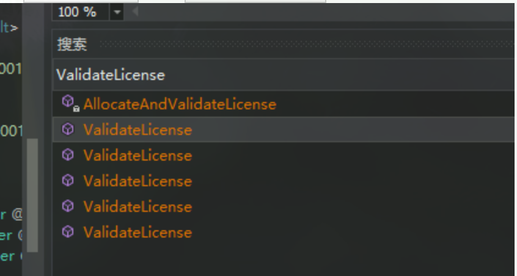
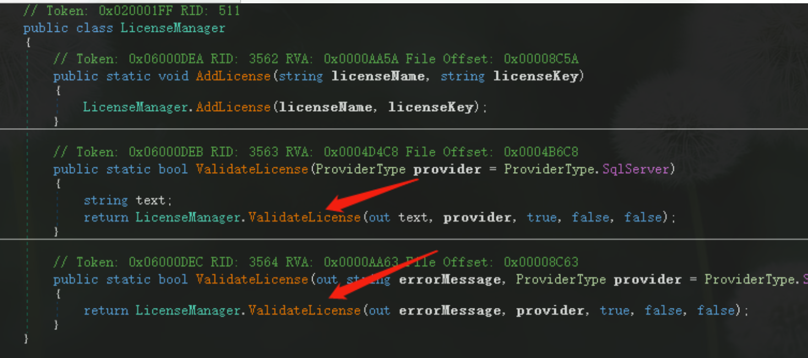
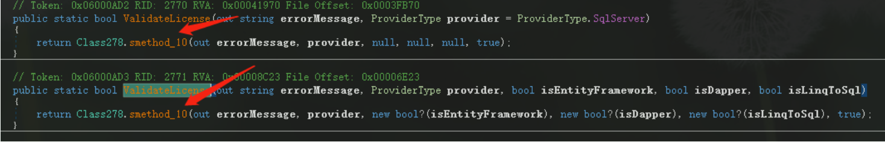
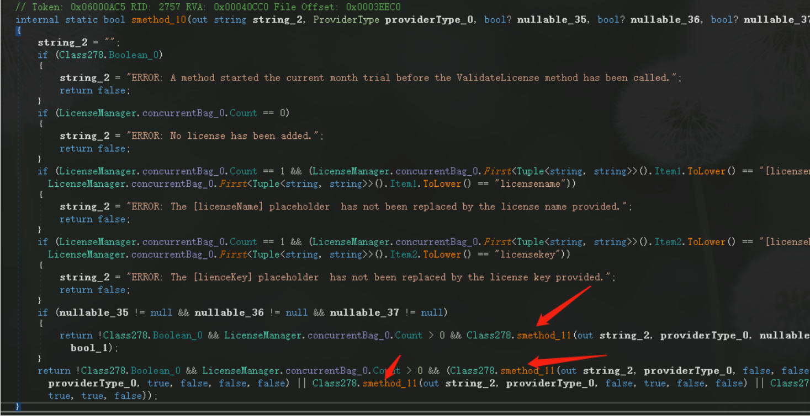
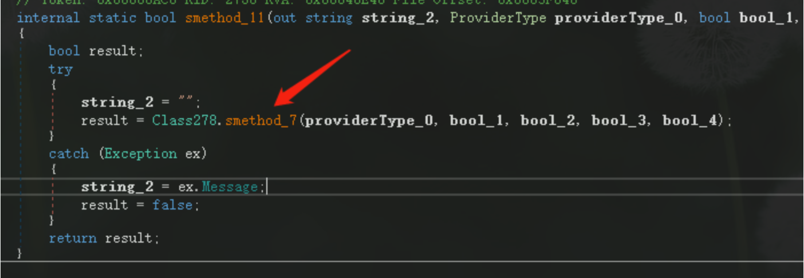
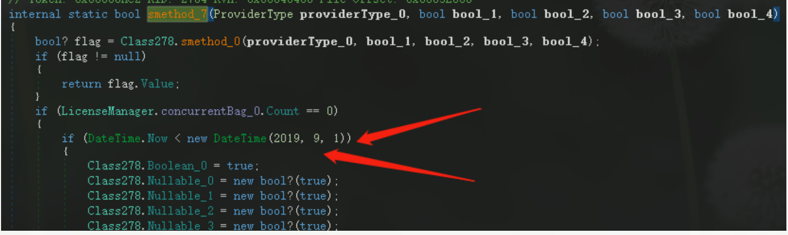
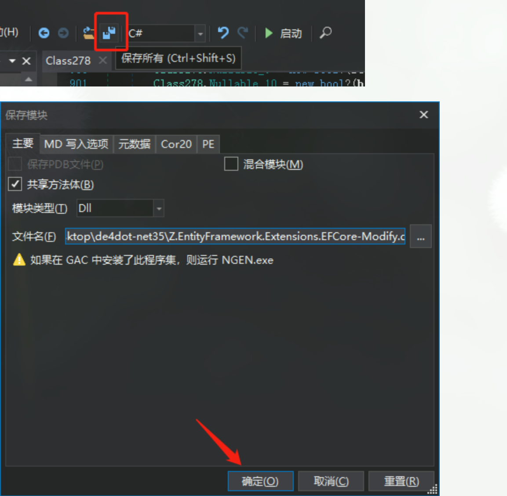

# EF大数据批量处理-效率提升

使用Nuget安装：`Z.EntityFramework.Extensions`

## 破解

### 脱壳

1. 找到 `Z.EntityFramework.Extensions.EFCore` 的Nuget包地址（右键属性可以查看），我的在 `C:\Users\Administrator\.nuget\packages\z.entityframework.extensions.efcore\2.6.11\lib\netstandard2.0` 

2. 下载de4dot:https://github.com/0xd4d/de4dot （文件脱壳）
   windows下载地址：https://ci.appveyor.com/project/0xd4d/de4dot/branch/master/artifacts
   下载：de4dot-net35

3. 解压后将 `Z.EntityFramework.Extensions.EFCore.dll` 拷贝到 `de4dot-net35` 解压目录，然后执行cmd命令

   `de4dot.exe Z.EntityFramework.Extensions.EFCore.dll`

它会在当前dll位置在生成一个 `Z.EntityFramework.Extensions.EFCore-cleaned.dll` 也就是格式化之后的dll

```go
C:\Users\Administrator\Desktop\de4dot-net35>de4dot.exe Z.EntityFramework.Extensions.EFCore.dll

de4dot v3.1.41592.3405 Copyright (C) 2011-2015 de4dot@gmail.com
Latest version and source code: https://github.com/0xd4d/de4dot

Detected Unknown Obfuscator (C:\Users\Administrator\Desktop\de4dot-net35\Z.EntityFramework.Extensions.EFCore.dll)
Cleaning C:\Users\Administrator\Desktop\de4dot-net35\Z.EntityFramework.Extensions.EFCore.dll
Renaming all obfuscated symbols
Saving C:\Users\Administrator\Desktop\de4dot-net35\Z.EntityFramework.Extensions.EFCore-cleaned.dll
```


### 使用dnSpy修改程序集

1. 下载dnSpy：https://github.com/0xd4d/dnSpy/releases 
   下载：dnSpy-netcore-win64.zip 

2. 运行 `dnSpy.exe` ，并打开 `Z.EntityFramework.Extensions.EFCore-cleaned.dll` 

3. 按 `Ctrl+Shift+K` 查找 `ValidateLicense`

   

   选择第一个 `ValidateLicense` 双击，然后点击内部的 `LicenseManager.ValidateLicense` ，然后继续点击内部的 `LicenseManager.ValidateLicense` 



然后点击 `Class278.smethod_10` 



然后点击 `Class278.smethod_11` 



然后点击 `Class278.smethod_7` 



最终找到时间判断



保存



4. 重命名，然后项目直接添加引用即可


> 以上修改方法，根据版本迭代修改方法略有不同。
>
> 附上已经修改文件：

## The end.