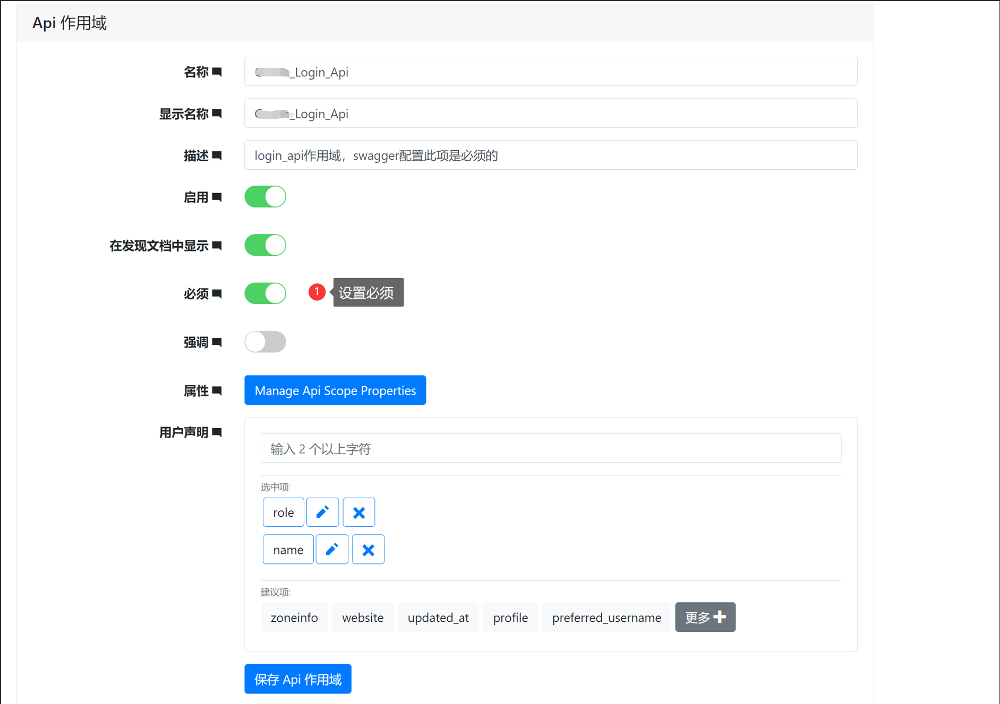
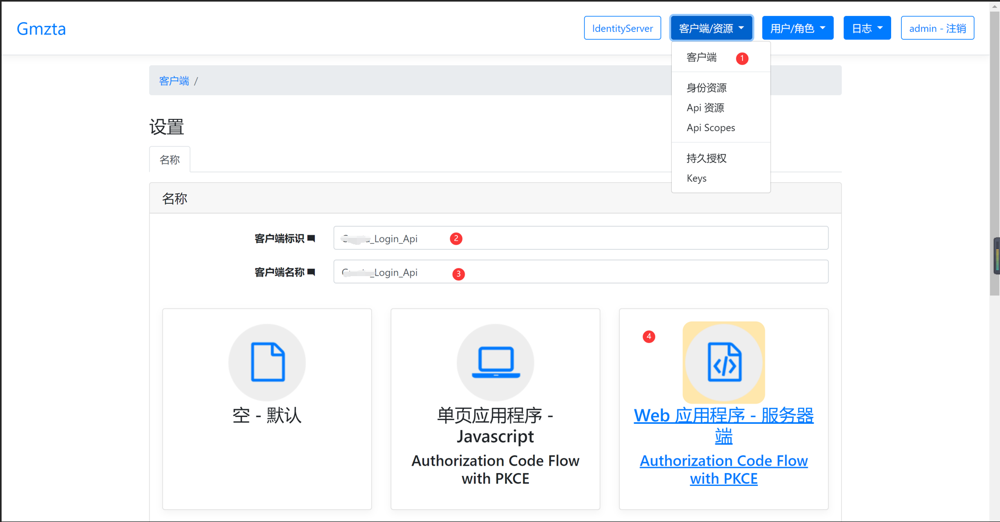
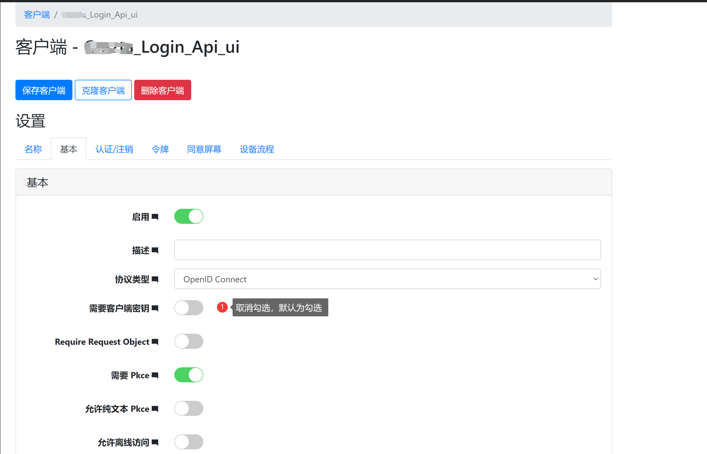
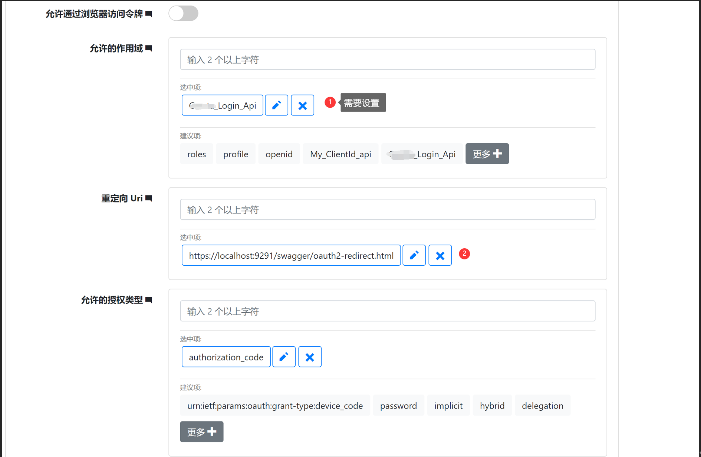
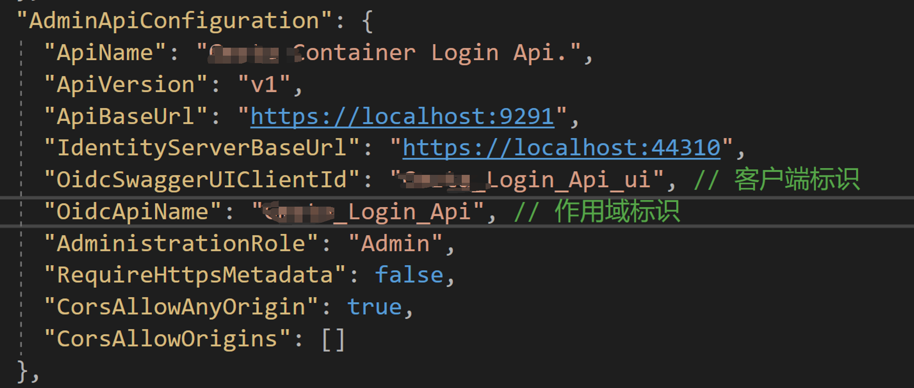
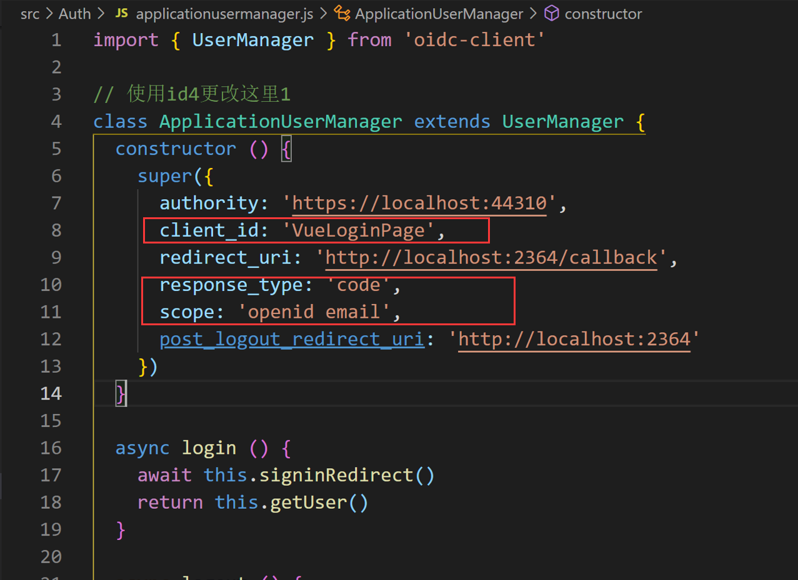
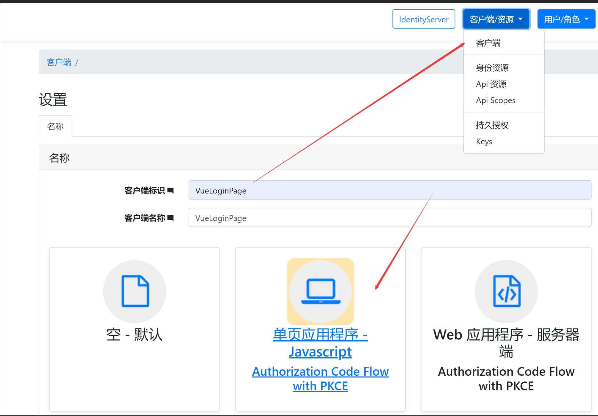
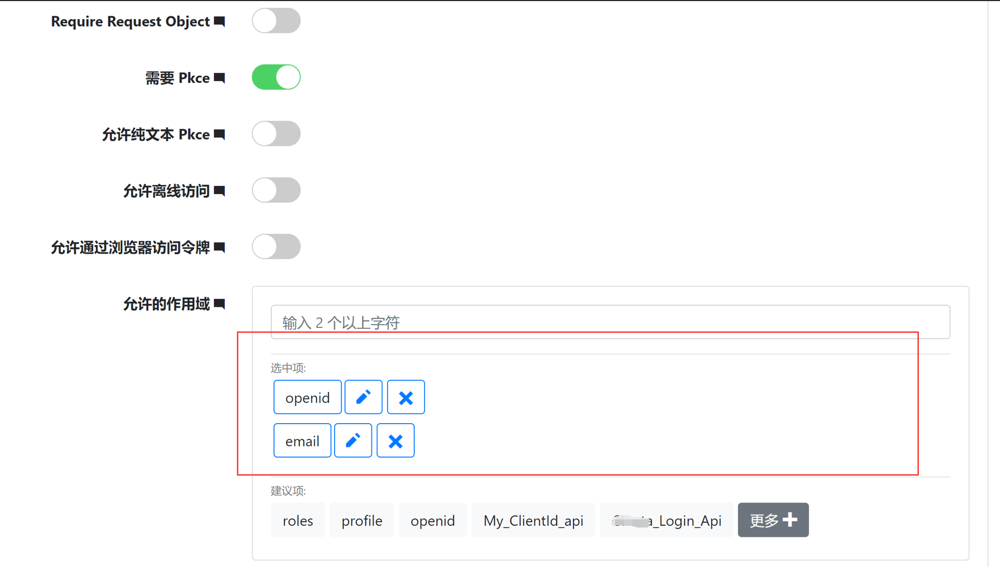
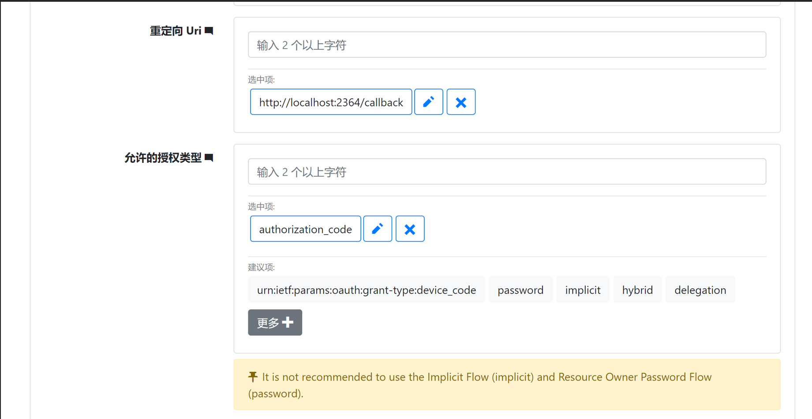

# Duende IdentityServer 和 Asp.Net 核心身份的管理

Github:[GitHub - skoruba/Duende.IdentityServer.Admin：Duende IdentityServer 和 Asp.Net Core Identity ⚡ 的管理](https://github.com/skoruba/Duende.IdentityServer.Admin)

## 添加Api客户端

Login.Api 为例

Ids4配置地址：https://localhost:44303/Configuration/Clients

### 必须添加Api Scope

### 添加客户端

添加

基本设置

如下图，其中作用设置必须已有的。

###  Appsetting

## 添加Vue

### Vue

### 添加客户端

    基础设置注意作用域，需要在配置中设置。

    注意配置跨域来源、注销地址

## The end.
