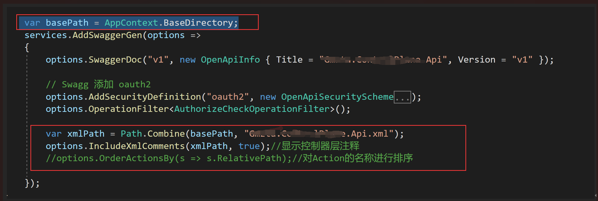
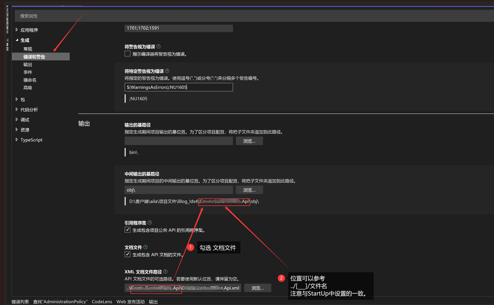

# Net Core Api Swagger 添加显示注释

## StartUp中配置

> 在 ConfigureServices 中添加 

相关代码：

```c#
var basePath = AppContext.BaseDirectory;

var xmlPath = Path.Combine(basePath, "Gmzta.ControlPlane.Api.xml");
options.IncludeXmlComments(xmlPath, true);//显示控制器层注释
//options.OrderActionsBy(s => s.RelativePath);//对Action的名称进行排序
```

如图：



##  设置属性-勾选文档生成

> 错误代码取消1591显示



## The End.
