# 创建发布

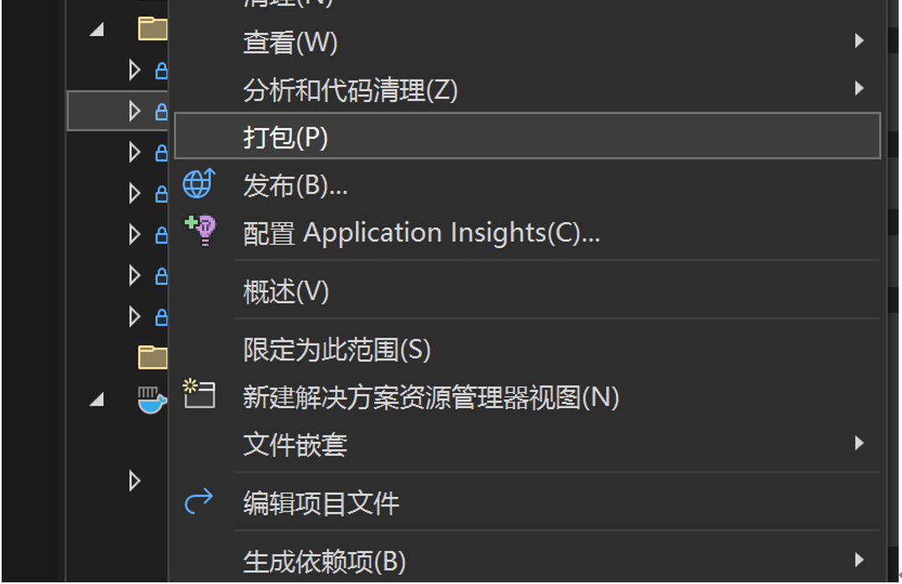

# 依次点击

> 发布 -> 新建 -> Doker容器注册表 -> 下一步

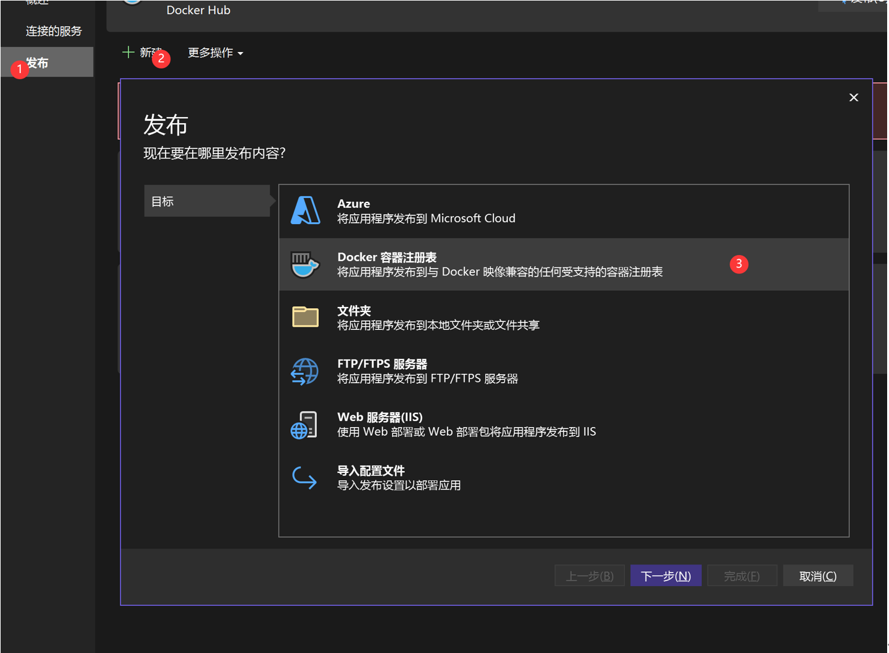

# 其他Docker容器注册表 -> 下一步

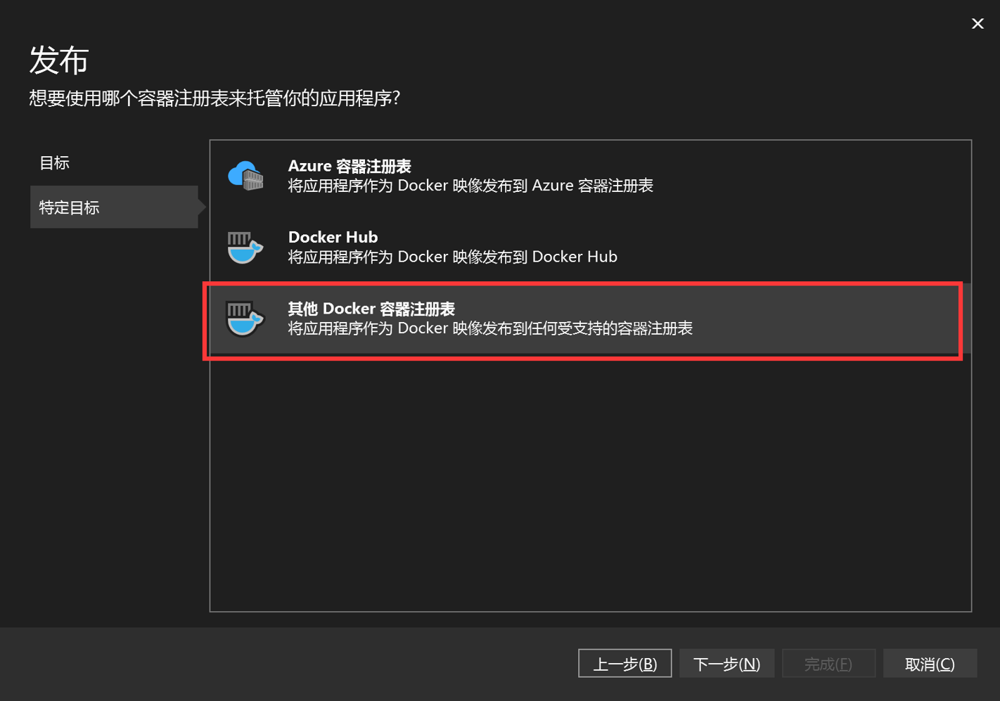

# 填写注册信息

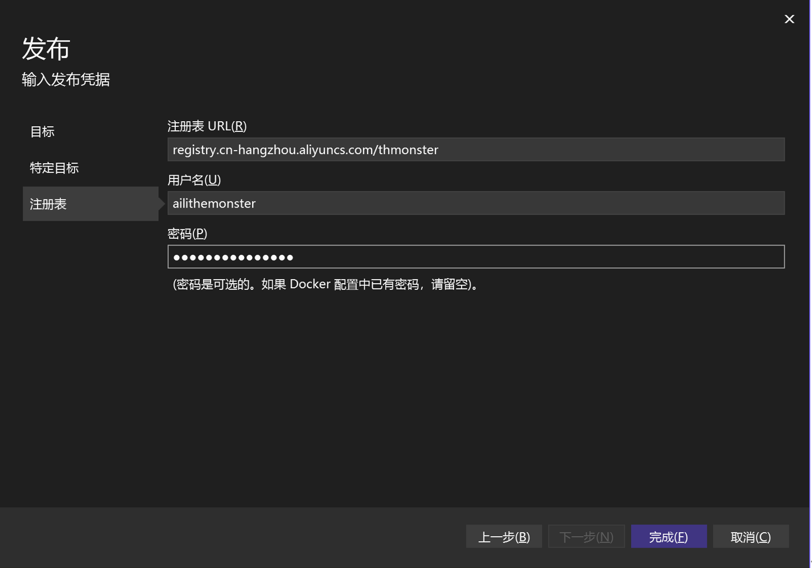

## 说明:

### 注册表信息

> 实例公网地址/空间名称

- 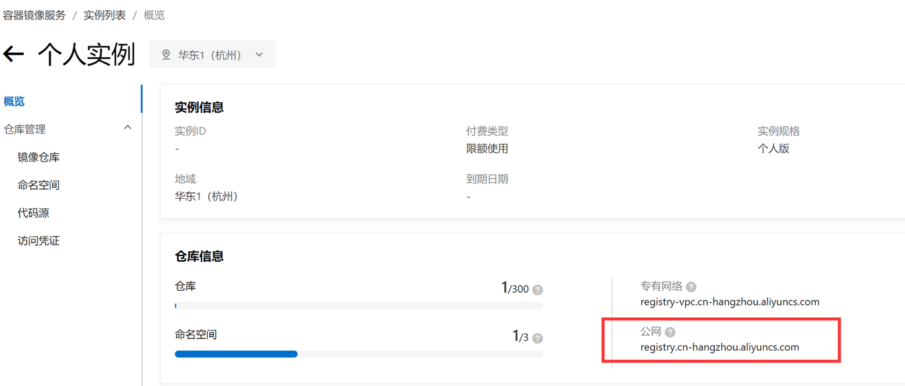
- 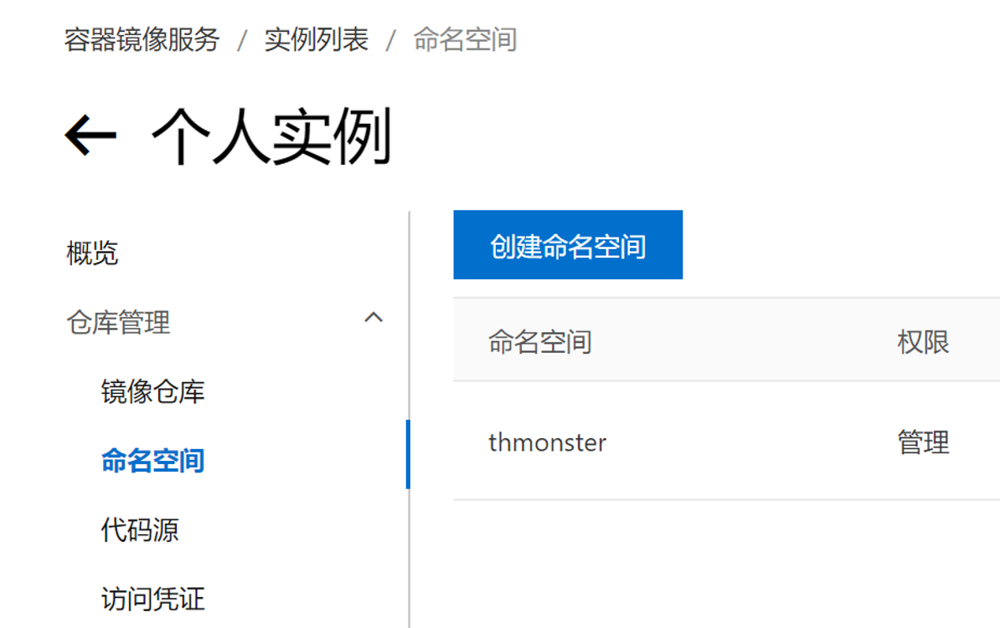

​		

###  用户名

>  右上角头像会出现信息

- 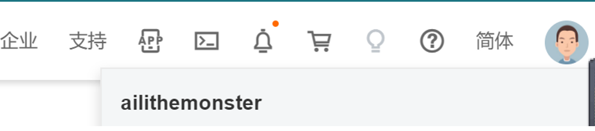

### 密码 

> 密码为开通服务时设置的密码

- 也可以在凭证中修改
- 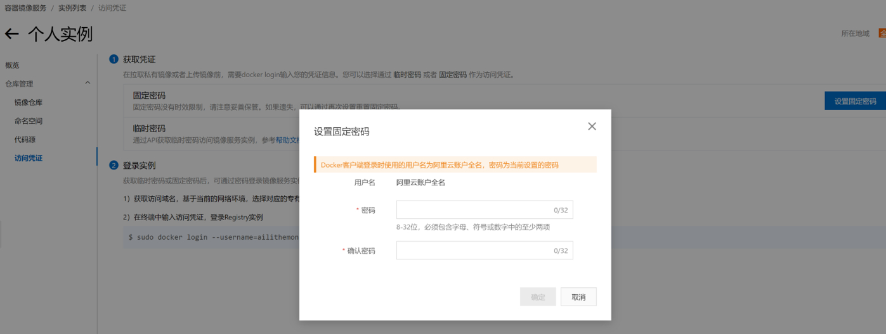

​		

# 编辑镜像标签

> 自动生成 或者 自定义(自定义为当前时间)

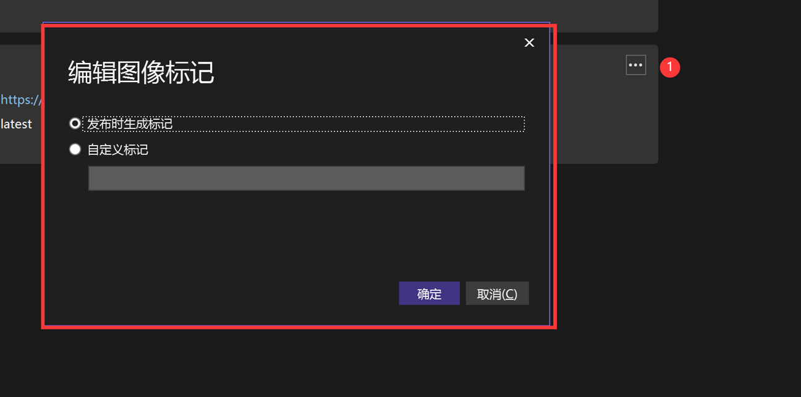

# 点击发布

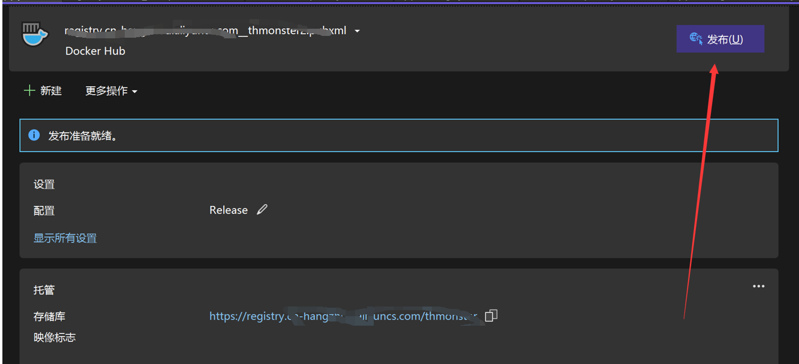

# 成功提示

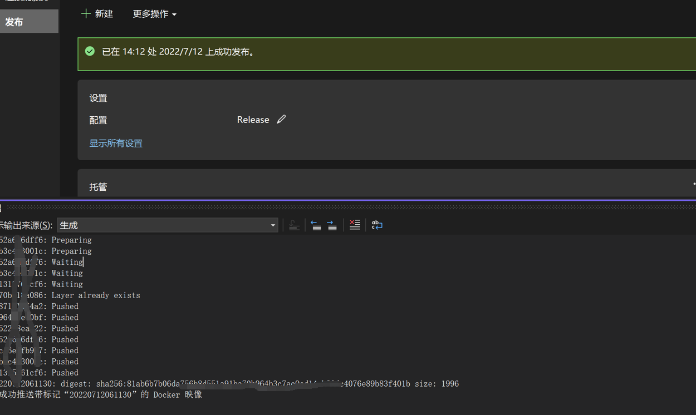
