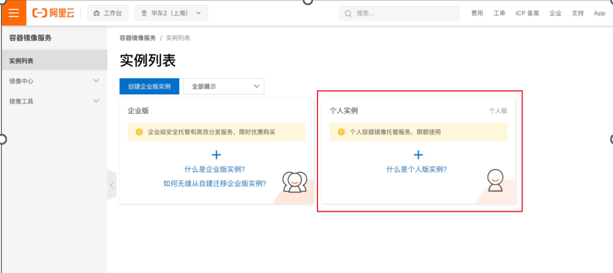
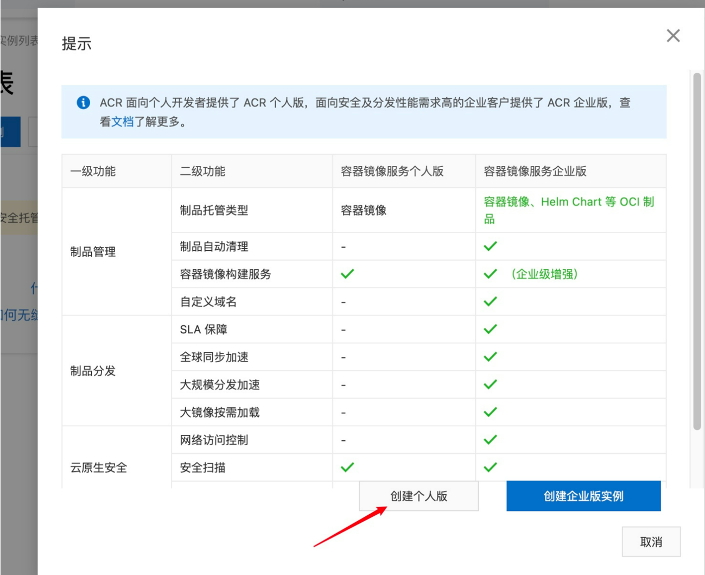
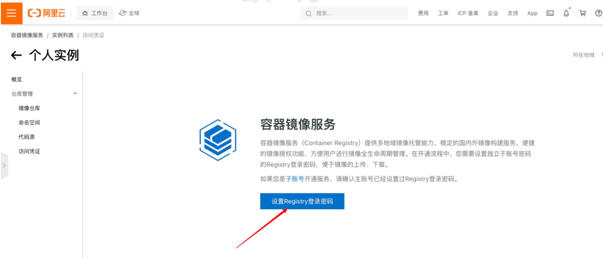
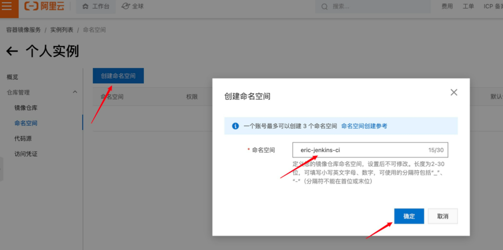
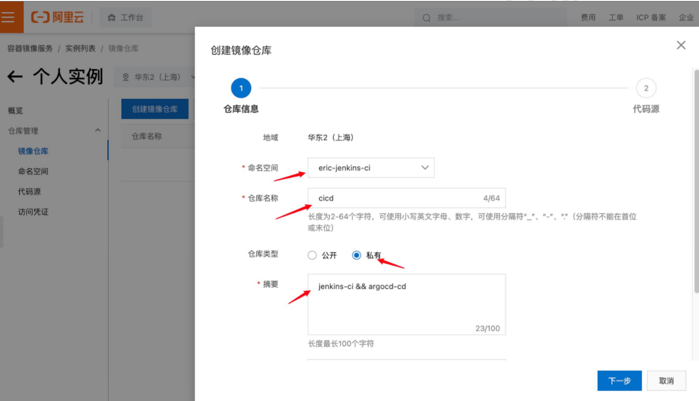
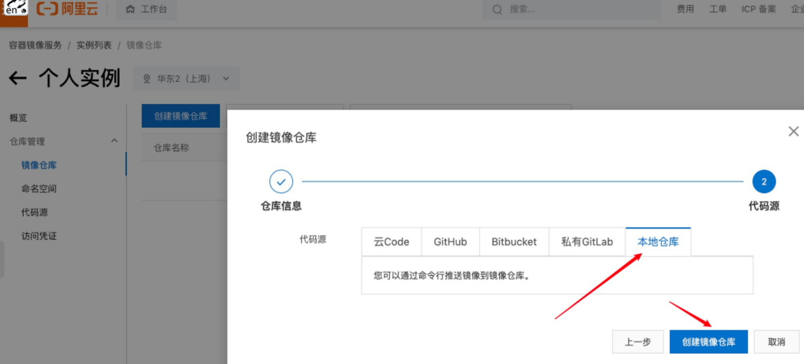
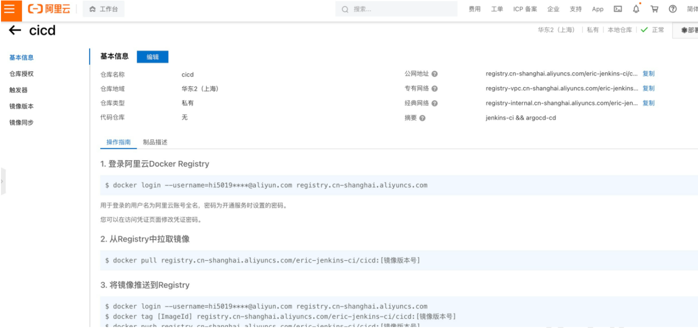
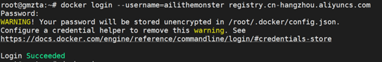
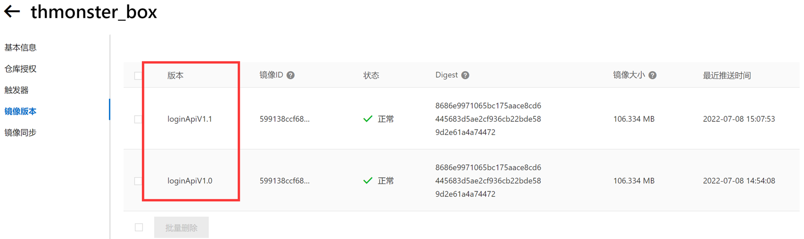

# 创建仓库

进入主页：[容器镜像服务](https://cr.console.aliyun.com/)

参考文档：https://blog.csdn.net/nuptaxin/article/details/124008353

## 选择个人实例



## 创建个人版



## 创建完成，点击设置Registry登录密码



## 创建[命名空间](https://so.csdn.net/so/search?q=命名空间&spm=1001.2101.3001.7020)(全网唯一)



## 创建镜像仓库



## 选择本地仓库



## 创建成功



# 推送

> 参考仓储基本信息中操作指南

### 登录

~~~shell
docker login --username=ailithemonster registry.cn-hangzhou.aliyuncs.com
~~~



### 推送

~~~shell
$ docker tag [ImageId] registry.cn-hangzhou.aliyuncs.com/thmonster/thmonster_box:[镜像版本号]

$ docker push registry.cn-hangzhou.aliyuncs.com/thmonster/thmonster_box:[镜像版本号]
~~~

> [镜像版本号] – 自定义一个名称

### 拉取

- 私有仓储拉取前需要登录
- [镜像版本号] – 可以在镜像版本中查看

```shell
$ docker pull registry.cn-hangzhou.aliyuncs.com/thmonster/thmonster_box:[镜像版本号] 
```




# The End.


