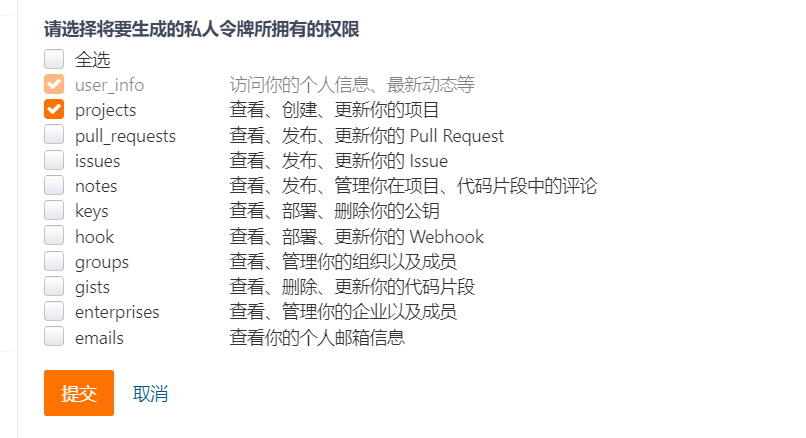
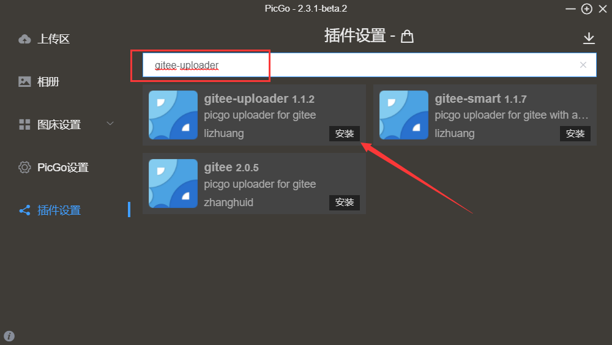
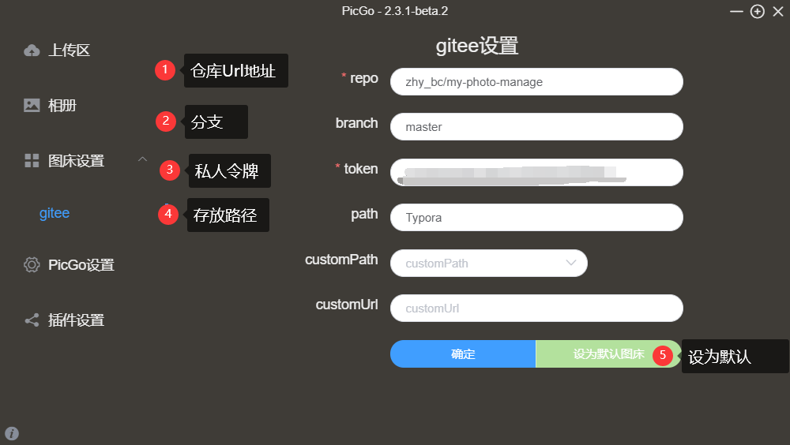
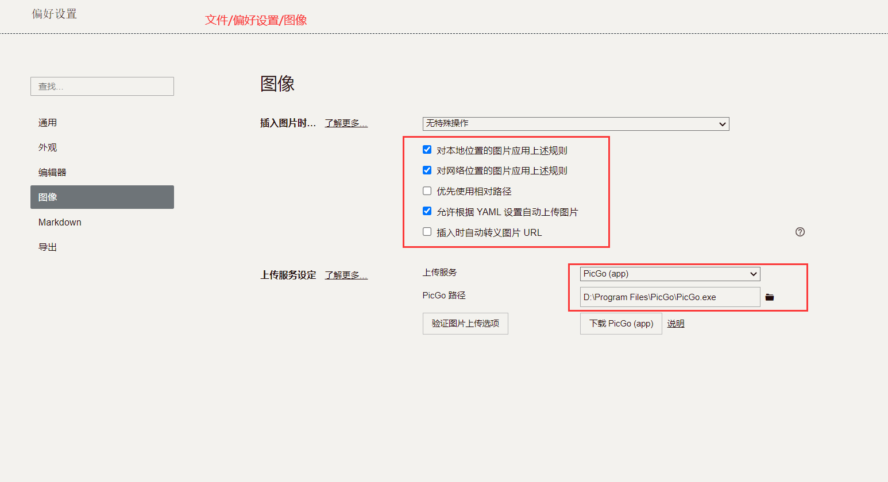

# [Typroa+Picgo+Gitee]图床

> Typora破解版下载链接: https://pan.baidu.com/s/1ilo0dXI0zI9HeqVupMiKvw 提取码: ameh 
>
> PicGo下载 : https://molunerfinn.com/PicGo/

## Gitee

1. Gitee创建一个 **公开** 的空仓库作为图床

2. 生成令牌

   **权限设置**

## Picgo 配置

1. 下载gitee-uploader

   或者 上传本地插件

2. 配置gitee

## Typora

1. 

## The End.
