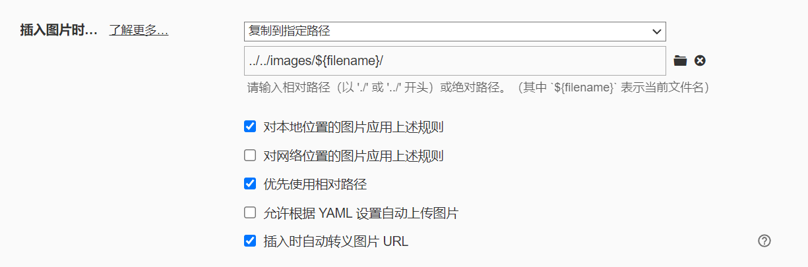

> 关于.......关于啥....还没想好..........来都来了，吃碗面吧！！！

---

## 本站信息：

使用`Hexo`搭建，详见[`Hexo`官网](https://hexo.io/zh-cn/docs/):https://hexo.io/zh-cn/docs

主题地址：https://butterfly.js.org/

~~部署在`gitee`中，当然你也可以使用`github`，gitee国内加载比较快，但是禁用使用个人域名了。github还是可以的，发布内容后也就是提交Git后，github会自动部署，gitee不会。~~

~~*第一次使用gitee Pages需要手持身份证照片，审核通过后才可以部署。~~

> gitee 对个人仓库进行了限制......

Git项目地址：https://github.com/zhybc/myBlogCore

 unicode value of Font Awesome icon：https://fontawesome.com/v5/cheatsheet?from=io

imgUrl：

1. https://www.imgurl.org/vip/manage/upload

2. 内部路径

   

初始化项目参考`Hexo命令`

Chat On Gitter ！！！

## The End.
